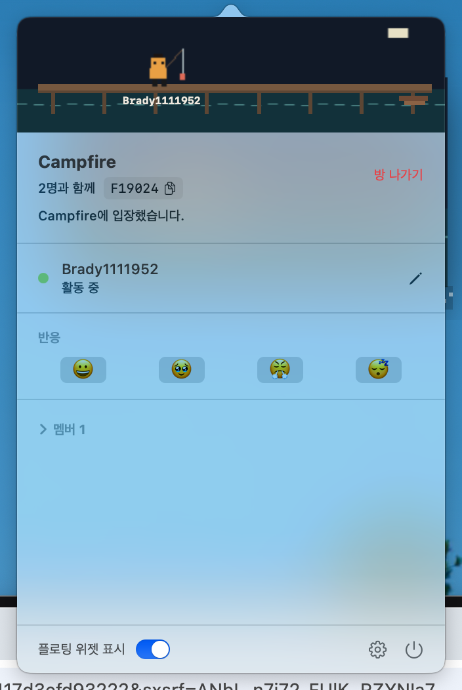
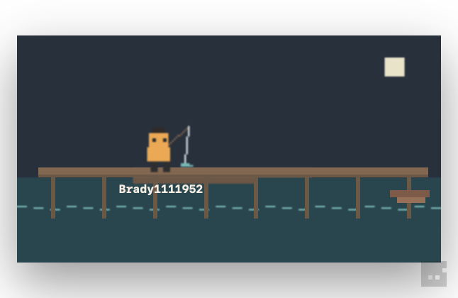

# Campfire

macOS용 ambient presence 컴패니언 앱입니다.
같은 가상 방에 있는 사람들의 상태를 픽셀아트 씬으로 실시간 확인할 수 있습니다.

<!-- TODO: 앱 대표 스크린샷 (로비 또는 플로팅 위젯 전체 모습) -->

## 요구사항

- macOS 14 (Sonoma) 이상

## 설치

터미널에서 아래 명령어를 실행하세요.

```sh
curl -fsSL https://raw.githubusercontent.com/SUSUSISI/campfire-releases/main/install.sh | sh
```

또는 [Releases](https://github.com/SUSUSISI/campfire-releases/releases) 페이지에서 DMG 파일을 직접 다운로드할 수 있습니다.

## 시작하기

앱을 실행하면 메뉴바에 아이콘이 나타나며, 별도의 입력 없이 바로 사용할 수 있습니다.
아이콘을 클릭하면 팝오버가 열리고, 봇방(오프라인)은 곧바로 즐길 수 있습니다.

온라인 방을 처음 사용할 때는 **온라인 방 사용 시작** 버튼을 누른 뒤 권한을 허용해야 합니다.
이 권한은 로그인 정보를 안전하게 저장하는 데 사용되며, 거부하더라도 로컬 방과 봇방은 계속 사용할 수 있습니다.

## 기능

### 방 참여

메뉴바 아이콘을 클릭하면 팝오버가 열립니다.

<!-- TODO: 로비 화면 스크린샷 (랜덤방/코드 입장/방 생성 버튼) -->

- **랜덤방 입장** — 빈 자리가 있는 방에 무작위로 입장합니다.
- **코드로 방 진입** — 6자리 방 코드를 입력해 특정 방에 입장합니다.
- **방 생성** — 이름과 테마(캠프파이어 / 낚시)를 선택해 새 방을 만듭니다.
- **봇방** — 인터넷 연결 없이 오프라인으로 씬을 즐길 수 있습니다.

랜덤방·코드 입장·방 생성은 온라인 방 기능으로, 처음 사용할 때 한 번 **온라인 방 사용 시작**으로 권한을 허용해야 활성화됩니다(위 [시작하기](#시작하기) 참고). 봇방은 권한 없이 바로 이용할 수 있습니다.

방 코드는 방 헤더에서 복사할 수 있으며, 코드를 공유해 같은 방에 초대할 수 있습니다.

### 방 안



방에 입장하면 현재 함께 있는 멤버와 각자의 상태를 확인할 수 있습니다.
이모지 버튼으로 리액션을 보내거나, 닉네임을 수정할 수 있습니다.

### Presence 상태

마우스/키보드 활동에 따라 캐릭터 상태가 자동으로 바뀝니다.

<!-- TODO: 4가지 presence 상태 캐릭터 이미지 (활동 중 / 잠시 멈춤 / 졸음 / 수면) -->

| 상태 | 전환 조건 |
|---|---|
| 활동 중 | 키보드/마우스 사용 중 |
| 잠시 멈춤 | 1분 동안 입력 없음 |
| 졸음 | 5분 동안 입력 없음 |
| 수면 | 10분 동안 입력 없음 |

설정에서 활동 감지를 끄면 상태가 자동으로 변하지 않습니다.

### 리액션

방 안에서 이모지 버튼을 누르면 내 캐릭터 위에 리액션이 표시됩니다.
같은 방에 있는 사람들에게도 실시간으로 보입니다.

단축키(Option + 키)를 설정해두면 팝오버를 열지 않고도 리액션을 보낼 수 있습니다.

### 플로팅 위젯

화면 위에 항상 띄워둘 수 있는 픽셀아트 창입니다.



- 상단을 드래그해서 위치를 바꿀 수 있습니다.
- 우하단 핸들로 크기를 조절할 수 있습니다.
- **클릭 잠금** 모드를 켜면 클릭이 위젯을 통과해 아래 창을 클릭할 수 있습니다.

메뉴바 팝오버 하단의 토글 또는 단축키로 표시/숨기기를 전환할 수 있습니다.

## 설정

메뉴바 팝오버 우하단 기어 아이콘으로 설정 창을 엽니다.

<!-- TODO: 설정 창 스크린샷 -->

| 항목 | 설명 |
|---|---|
| 언어 | 한국어 / English |
| 활동 감지 | presence 자동 전환 켜기/끄기 |
| 업데이트 | 자동 (새 버전 발견 시 즉시 설치) / 수동 (알림만 표시) |
| 플로팅 위젯 | 투명도 조절, 클릭 잠금 |
| 퀵 위젯 키 | Option + 키로 리액션 전송, 위젯 표시/클릭잠금 단축키 설정 |

## 업데이트

앱이 실행 중일 때 새 버전이 릴리즈되면 자동으로 감지합니다.

- **자동 모드**: 다운로드 후 카운트다운과 함께 자동으로 재시작됩니다.
- **수동 모드**: 메뉴바에 알림이 표시되며 직접 설치 버튼을 눌러 업데이트합니다.

각 버전의 DMG 파일은 [Releases](https://github.com/SUSUSISI/campfire-releases/releases) 페이지에서 직접 다운로드할 수도 있습니다.
